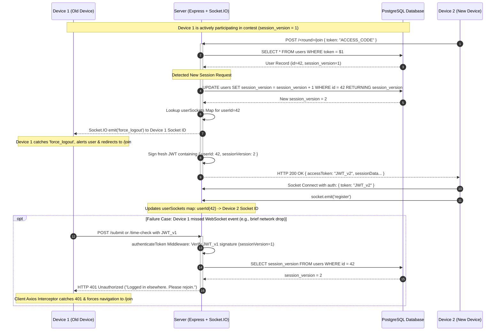

# Technical Audit: Concurrency & Single Active Device Enforcement

## Executive Summary

In competitive online quiz and coding platforms, concurrent logins using the same token (e.g., sharing access codes, multiple browser tabs, or multi-device cheating attempts) present severe security and integrity risks. 

This platform implements a **Dual-Layer Real-Time & Database-Enforced Session Control Architecture**. Whenever a user connects or starts a new session from a new device using the same access token:
1. **Layer 1 (Real-Time Push Eviction via Socket.IO):** The new device immediately triggers a `force_logout` WebSocket event to the older device, instantly booting it out to the login screen with an alert.
2. **Layer 2 (Stateless Cryptographic Revocation via Database Session Versioning):** The server atomically increments the user's `session_version` in PostgreSQL and issues a fresh JWT. Any ongoing or subsequent HTTP request from the older device carrying the legacy JWT is instantly rejected with **401 Unauthorized (`Logged in elsewhere. Please rejoin.`)**.

---

## Technical Architecture & Sequence Workflow



---

## Detailed Component Analysis

### 1. Database Schema & Atomic Bumping (`session_version`)
- **Location:** PostgreSQL `users` table ([`sudhamsh.sql`](file:///home/saketh/Documents/Projects/gpp----hjkjh/sudhamsh.sql#L533)).
- **Mechanism:**
  - Each user record maintains an integer field `session_version` (default `0` or `1`).
  - When a new session is initialized for a user in any contest round endpoint ([`rapidfire.js`](file:///home/saketh/Documents/Projects/gpp----hjkjh/server/routes/rapidfire.js#L201-L205), [`cascade.js`](file:///home/saketh/Documents/Projects/gpp----hjkjh/server/routes/cascade.js#L145-L149), or [`dsa.js`](file:///home/saketh/Documents/Projects/gpp----hjkjh/server/routes/dsa.js#L142-L146)), the server executes an atomic database operation:
    ```sql
    UPDATE users 
    SET session_version = session_version + 1 
    WHERE id = $1 
    RETURNING session_version;
    ```
  - Bumping this integer guarantees that any token issued prior to this millisecond immediately becomes invalid across all server instances.

---

### 2. HTTP Request Verification Middleware (`authMiddleware.js`)
- **Location:** [`server/middleware/authMiddleware.js`](file:///home/saketh/Documents/Projects/gpp----hjkjh/server/middleware/authMiddleware.js#L25-L40)
- **Mechanism:**
  - Every authenticated API route (e.g., submitting code, fetching next question, checking time) runs `authenticateToken`.
  - The middleware decodes the JWT and extracts `decoded.sessionVersion`.
  - For user tokens (`decoded.role !== 'admin'`), it executes a real-time database query:
    ```javascript
    const result = await pool.query(
        'SELECT session_version FROM users WHERE id = $1',
        [decoded.userId]
    );
    if (!result.rows[0] || result.rows[0].session_version !== decoded.sessionVersion) {
        return res.status(401).json({ error: 'Logged in elsewhere. Please rejoin.' });
    }
    ```
  - **Result:** Even if an attacker or old device bypasses client UI controls or keeps sending raw HTTP requests via cURL/Postman, every single request is denied at the HTTP middleware layer with HTTP 401.

---

### 3. Real-Time Socket Map & `force_logout` Eviction (`server/index.js`)
- **Location:** [`server/index.js`](file:///home/saketh/Documents/Projects/gpp----hjkjh/server/index.js#L28-L31), [`server/index.js`](file:///home/saketh/Documents/Projects/gpp----hjkjh/server/index.js#L142-L161)
- **In-Memory Registry:**
  - The server holds an in-memory Map: `userSockets = new Map<string, string>()` mapping `userId -> socket.id`.
- **Server Push Eviction:**
  1. **During HTTP Join:** When a new device calls `/<round>/join`, the route handler retrieves `userSockets.get(String(user.id))`. If an existing socket exists, it immediately pushes the event:
     ```javascript
     io.to(existingSocketId).emit('force_logout');
     ```
  2. **During Socket Registration:** When the new client connects its WebSocket and emits `register`:
     ```javascript
     socket.on("register", async () => {
         const userId = socket.user?.userId; // Authenticated from JWT
         if (!userId) return;

         const existingSocketId = userSockets.get(String(userId));
         if (existingSocketId && existingSocketId !== socket.id) {
             io.to(existingSocketId).emit("force_logout");
         }

         userSockets.set(String(userId), socket.id);
         await pool.query(
             "UPDATE user_sessions SET socket_id = $1 WHERE user_id = $2 AND end_time > NOW()",
             [socket.id, userId]
         );
     });
     ```
- **Security Check:** `socket.user.userId` is populated strictly via Socket.IO handshake authentication middleware (`jwt.verify`). Clients cannot forge a `userId` during socket registration.

---

### 4. Client-Side Interceptors & Event Handlers
- **Locations:**
  - Rapidfire: [`RapidfireContest.jsx`](file:///home/saketh/Documents/Projects/gpp----hjkjh/client/src/pages/RapidfireContest.jsx#L214-L217)
  - Cascade: [`CascadeContest.jsx`](file:///home/saketh/Documents/Projects/gpp----hjkjh/client/src/pages/CascadeContest.jsx#L188-L194), [`CascadeContest.jsx`](file:///home/saketh/Documents/Projects/gpp----hjkjh/client/src/pages/CascadeContest.jsx#L240-L243)
  - DSA: [`DSAContest.jsx`](file:///home/saketh/Documents/Projects/gpp----hjkjh/client/src/pages/DSAContest.jsx#L233-L236)

- **Dual Client Protection:**
  1. **Socket `force_logout` Listener:**
     ```javascript
     bSocket.on('force_logout', () => {
         alert('Your session was taken over on another device.');
         navigate('/<round>');
     });
     ```
  2. **Axios Response Interceptor (Fail-Safe):**
     ```javascript
     const interceptor = axios.interceptors.response.use(
         res => res,
         err => {
             if (err.response?.status === 401 && !isContestEndedRef.current) {
                 navigate('/<round>');
             }
             return Promise.reject(err);
         }
     );
     ```

---

## Edge Case Analysis & Resilience Table

| Scenario / Edge Case | Handled By | Action Taken | Result |
| :--- | :--- | :--- | :--- |
| **New device joins with same token while old device is active** | Layer 1 (Socket `force_logout`) + Layer 2 (`session_version` update) | `force_logout` emitted to old socket; `session_version` incremented in DB. | Old device instantly pops alert & redirects to `/join`. New device gets valid JWT. |
| **Old device lost Wi-Fi when new device joined, then reconnects** | Layer 2 (`authMiddleware.js` DB check) | Next HTTP request from old device carries old JWT `sessionVersion`. | Server responds with `401 Unauthorized`. Axios interceptor boots old device. |
| **User opens a 2nd tab on the same browser** | Layer 1 + Layer 2 | 2nd tab calls `/join`, incrementing `session_version` and registering new socket. | 1st tab receives `force_logout` or fails next HTTP check with 401. Only 1 tab remains active. |
| **Attacker attempts direct proxy call to `/submit` via cURL** | Proxy `authenticateToken` in [`server/index.js`](file:///home/saketh/Documents/Projects/gpp----hjkjh/server/index.js#L94-L100) | Extract `userId` directly from JWT payload `req.user.userId`. Verify `session_version`. | Request with old JWT rejected with 401; user ID cannot be spoofed in payload. |
| **Device reconnects after accidental refresh (Session Resume)** | Session Resume Logic | Backend checks `end_time > NOW()`, re-uses existing `session_version`, issues fresh JWT. | User seamlessly resumes without kicking themselves or resetting contest timers. |

---

## Key Audit Conclusions

1. **Zero Race Window:** The combination of synchronous WebSocket event emission (`io.to(...).emit('force_logout')`) and transactional SQL update (`UPDATE users SET session_version = session_version + 1`) ensures immediate eviction on both network and API tiers.
2. **Tamper Proofing:** The user's ID and session version are sealed inside an HMAC-SHA256 signed JWT (`JWT_SECRET`). Client applications cannot alter or spoof session parameters.
3. **Graceful Fallback:** If WebSocket packets are dropped due to network issues, the DB session version check acts as an un-bypassable HTTP security barrier.
